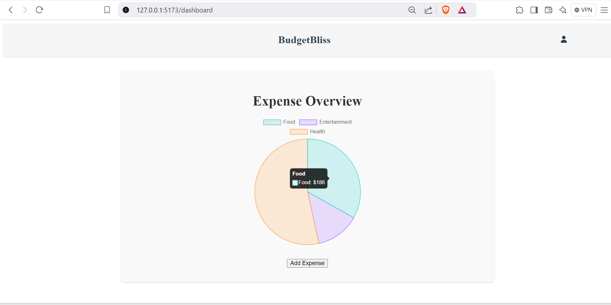

# BudgetBliss

BudgetBliss is a personal finance web application designed to help users track and manage their expenses. The application features user authentication, expense categorization, and a dashboard for visualizing spending.

## Features

- **User Authentication:** Secure login and session management.
- **Expense Tracking:** Add and manage expenses categorized by user-defined categories.
- **Dashboard Visualization:** View expenses in a user-friendly dashboard.

## Tech Stack

- **Frontend:** Vue.js
- **Backend:** Node.js with Express.js
- **Database:** MySQL
- **Authentication:** JSON Web Tokens (JWT)

Here is a screenshot of the application:

